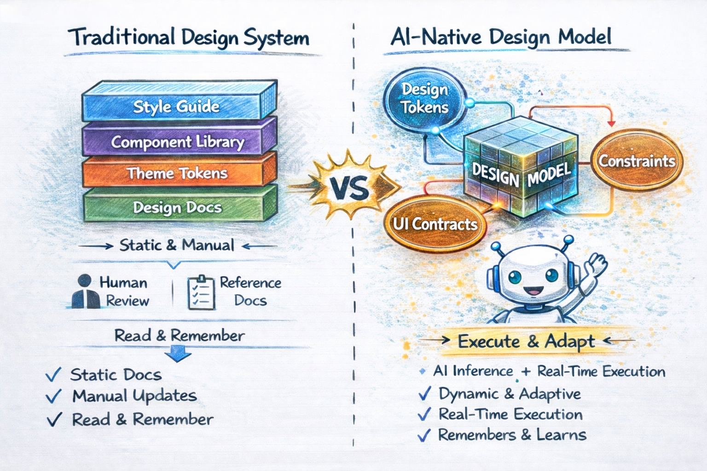

# Design Model

**An executable evolution of design systems.**

Design Systems were built to be **read**.  
Design Models are built to be **executed**.

This repository is a small, focused proof of that idea.



---

## What is this?

This repo demonstrates a **Design Model**:  
a design system expressed as an executable model that AI tools and engineers can safely operate inside.

Instead of documenting rules and hoping they’re followed,  
a Design Model **enforces design decisions at runtime**.

The demo intentionally starts small — with a single Button component — to make the idea clear without distraction.

---

## Why does this exist?

AI-assisted coding tools can generate UI extremely fast.

AI:
- doesn’t read design documentation unless enforced
- doesn’t remember conventions
- doesn’t prevent invalid UI from being produced.

The result is often inconsistent, off-brand, or unshippable UI.

Design Models address this by turning design decisions into **machine-enforceable rules**.

---

## The Design Model (3 parts)

A Design Model has three executable layers:

### 1. Tokens  
Define what styles are allowed  
(colors, spacing, typography, radius, etc.)

### 2. Contracts  
Define what components exist and what props are valid  
(variants, sizes, defaults)

### 3. Constraints  
Define what decisions are *not allowed*  
(e.g. only one primary action per view)

UI is not *generated*.  
It is **resolved** against these rules.

---

## How is this different from a design system?

| Design System | Design Model |
|--------------|-------------|
| Documentation-first | Execution-first |
| Built for humans | Built for humans and AI |
| Rules are advisory | Rules are enforced |
| Violations caught in review | Violations blocked at runtime |

Design systems explain decisions.  
Design models **enforce** them.

---

## Is this just a component library or Storybook?

No.

- Component libraries ship components  
- Storybook documents usage  
- Design Models govern what is allowed to exist

AI can ignore documentation.  
It cannot ignore enforcement.

---

## Why does the demo start with no constraints?

Because constraints are **authored**, not assumed.

In the demo:
1. UI renders freely
2. You add a constraint
3. The same prompt now resolves differently

Nothing else changes — not the renderer, not the intent.

This makes governance explicit and intentional.

---

## Why only a Button?

On purpose.

Buttons are:
- universally understood
- easy to misuse
- easy to govern
- visually obvious when wrong

If a model can’t govern a Button, it won’t scale to more complex UI.

---

## What happens when a constraint is violated?

The system does not crash or fail.

Instead it:
- acknowledges the intent
- explains which constraint applies
- offers structured suggestions for AI agents (e.g. downgrade to secondary)

This is **assistive governance**, not policing.

---

## How does this work with AI-assisted coding tools?

The Design Model sits **between the AI and the code**:

Intent / Prompt
↓
AI assistant or agent
↓
Design Model (tokens + contracts + constraints)
↓
Resolved UI spec (valid by construction)
↓
Code generation

AI proposes.  
The Design Model decides.

---

## What should I try?

1. Run the demo
2. Create two primary buttons → works
3. Add constraint: “Only one primary button per view”
4. Run the same prompt → constrained resolution
5. Remove the constraint → works again

Then try:
- adding a new constraint
- adding a new component
- observing how behavior changes without touching the renderer

---

### ⚠️ IMPORTANT: shadcn/ui Usage

**shadcn/ui is used ONLY for the demo shell** (layout, panels, tabs, inputs, code area, run/reset controls).

**The rendered component preview must be our own renderer output**, using ONLY:
- `tokens/tokens.json`
- `contracts/*.json`
- `constraints/*.json`
- Resolver logic

**The renderer MUST NOT import or depend on shadcn components.** The preview output for components (e.g., Button) must be a plain `<button>` (or our own internal component), styled using resolved tokens (inline styles or simple class mapping).

---

## Contributing

This repo is intentionally small and focused.

Good contributions:
- a new component
- a new constraint
- a clearer rule or remediation

The goal is not feature completeness.  
The goal is clarity.

---

## Try the demo

1. Install dependencies:
```bash
npm install
```

2. Run the development server:
```bash
npm run dev
```

3. Open [http://localhost:3000](http://localhost:3000) in your browser.

## Demo Prompts

### Happy Path

Try this prompt (default on page load):
```
Create a primary button with label "Continue"
```

This will:
- Parse the intent
- Resolve tokens to CSS values
- Render a primary button with proper styling

### Constraint Failure

Try this prompt:
```
Create two primary buttons
```

**Without constraints**: This will pass and render two primary buttons.

**With constraints**: 
1. Go to the Constraints tab in the Model Editor
2. Type "only one" in the search field
3. Click "Only one primary button per view" to add it as a pill
4. Click Run
5. This will:
   - Parse the intent (creates two primary buttons)
   - Fail constraint validation (`onlyOnePrimaryPerView`)
   - Show error message referencing the constraint
   - Prevent rendering (nodes array is empty)
6. Remove the constraint pill and Run again → it will pass

---

## MCP Server and Auto-Fix

The Design Model exposes an MCP (Model Context Protocol) server that allows AI agents to validate view specs, suggest fixes for constraint violations, and apply those fixes automatically.

### Running the MCP Server

1. Install dependencies (if not already done):
```bash
npm install
```

2. Run the MCP server:
```bash
npm run mcp:dev
```

The server runs on stdio and exposes the following tools:

- **getDesignModel()** - Returns tokens, contracts, and enabled constraints metadata
- **validate(viewSpec, enabledConstraints)** - Validates a view spec against constraints (read-only)
- **suggestFixes(viewSpec, enabledConstraints, violations)** - Suggests JSON patch operations to fix violations
- **applyFixes(viewSpec, fixes)** - Applies JSON patch operations to a view spec

### Auto-Fix Demo

In the demo app, you can use the "Run with MCP (Auto-fix)" button to see the auto-fix flow in action:

1. Create a prompt with constraint violations (e.g., "Create two primary buttons")
2. Add the "Only one primary button per view" constraint
3. Click "Run with MCP (Auto-fix)"
4. The system will:
   - Validate and detect violations
   - Suggest fixes (downgrade second primary button to secondary)
   - Apply the fixes
   - Re-validate to confirm compliance
   - Show the resolution flow with helpful explanations

The auto-fix flow displays:
- **Constraint triggered**: Initial violations detected
- **Suggested fixes**: JSON patch operations
- **Resolution applied**: What constraints fired and what they did
- **Node decisions**: Actions applied to specific nodes
- **Final state**: Compliant view with resolved components

---

## Technology Stack

- **Next.js 16** - App Router with TypeScript
- **Tailwind CSS** - Styling
- **shadcn/ui** - Demo shell UI components only
- **React** - Component rendering

---

## Development

The resolver and renderer logic are fully implemented. The system:

- Parses natural language prompts deterministically
- Validates component props against contracts
- Enforces design constraints
- Resolves design tokens to CSS values
- Renders pure HTML elements with inline styles
- Provides MCP server for AI agent integration
- Supports auto-fix for constraint violations

### Project Structure

- `/tokens` - Design tokens (colors, spacing, typography, etc.)
- `/contracts` - Component contracts (props, variants, defaults)
- `/constraints` - Design constraints (rules and limits)
- `/resolver` - Core resolution logic (parseIntent, resolveComponent, validate, suggestFixes)
- `/renderer` - Component renderers (pure React components)
- `/mcp` - MCP server implementation
- `/app` - Next.js demo application

---

## One-line summary

**Design Systems scale consistency.  
Design Models scale decision-making.**

---

## License

MIT
